# Analysis of SJTU loading page

> *From the perspective of front-end*

## I. About Code Structure

### 1. Bad organization

Obviously., the code organization in this project did not achieve **decoupling and cohesion**. 

Except for some well-package widgets, the whole page is organized as a single file with a single long main function to init everything and a  single api to receive every information.

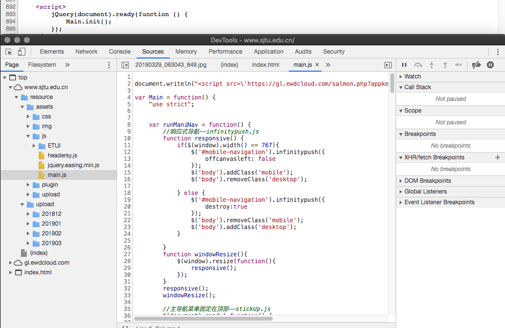
(put every thing in a single Main object and init them altogerther in the begining)


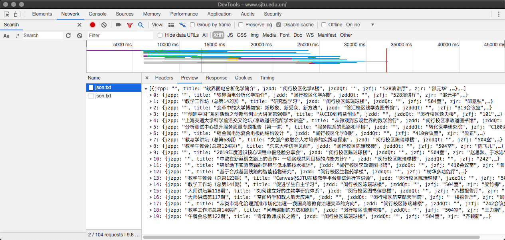
(all the information a recived as a single json from a single api) 

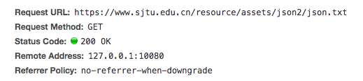
the poor api :( 

This kind of organization obviously violates the principle of **modularization** in modern software engineering.

### 2. Performance loss

As a certain result of the bad organization, performance loss is caused by the notoriously big object Main and its init() function.  When script run with it, every part and widgets will be loaded at one time, which extends the users' wating time and memory consuming. 

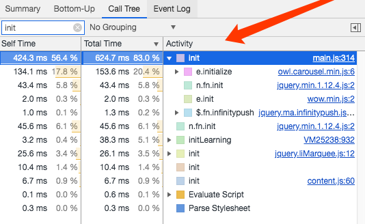

(Performance analysis proves it)

### 3. Suffering in maintenance

When checking the main.js where the Main object is defined, a mess of javascript code is shown. The defination of the Main object is upto **326 lines**. Each part of the inner code is also hard to read for it's Irregular indentation and poor comments.

In the index.html itself, a mount of helper function also defined without comments and perpose. Raw operations to strings fill thoes functions, making it much more difficlut to maintain this project.

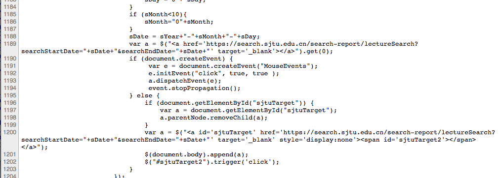
(Ugly helper funtion in index.html)

### 4. Comparison

```javascript
  API:{
    explore: {
      get_home_data: '"/api/explore/"',
      get_gallery_data: '"/api/explore/gallery/"',
      get_gallery_more_data: '"/api/explore/gallery/more_cards/"',
      get_collection_data: '"/api/explore/collection/"',
      get_recent_data: '"/api/explore/get_recent/"',
      get_product: '"/api/explore/product/"',
      post_collect: '"/api/explore/post_collect/"',
      delete_product: '"/api/explore/product/delete/"',
      cancel_collect: '"/api/explore/product/cancel_collect/"',
      post_search :'"/api/explore/post_search/"'
    },
    workflow: {
      push_match_event: '"/api/workflow/push_match_event"',
      post_picture: '"/api/workflow/post_picture/"',
      post_text: '"/api/workflow/post_text/"',
      confirm_style: '"/api/workflow/confirm_style/"',
      store_passage:'"/api/workflow/store_passage/"',
      finished_work: '"/api/workflow/finished_work/"',
      confirm_store: '"/api/workflow/confirm_store/"',
      download_picture: '"/api/workflow/download_picture/"',
    },
    user: {
      post_register: '"/api/user/register/"',
      login: '"/api/user/login/"',
      auth: '"/api/user/authenticate/"'
    },
    deepLearning: {
      get_embedding: '"/learning/embedding/"'
    }
  }
```

APIs in a VUE project.

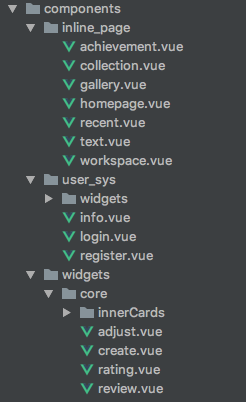

A modular VUE project. 

### 5. Optimizations

- Separate the whole page into functionally dependent parts.
- Write those parts in different files and provide apis for each one.
- Implement the methodology of modern software engineering -- decoupling and cohesion


## II. About Project Specification

### 1. Directory structure

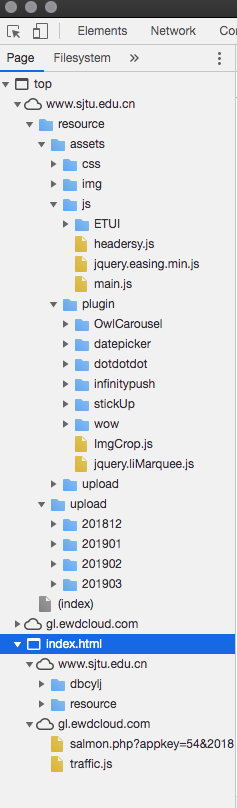

As is shown above, the directory structure of this project is a kind of messy. But the wrose is that the almost dupilcated directories appeared twice, causing unnecessary files transported in the network. So, the directory of this project is not clean and clear enough.

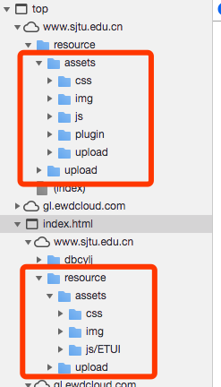

 

### 2. Programming specification

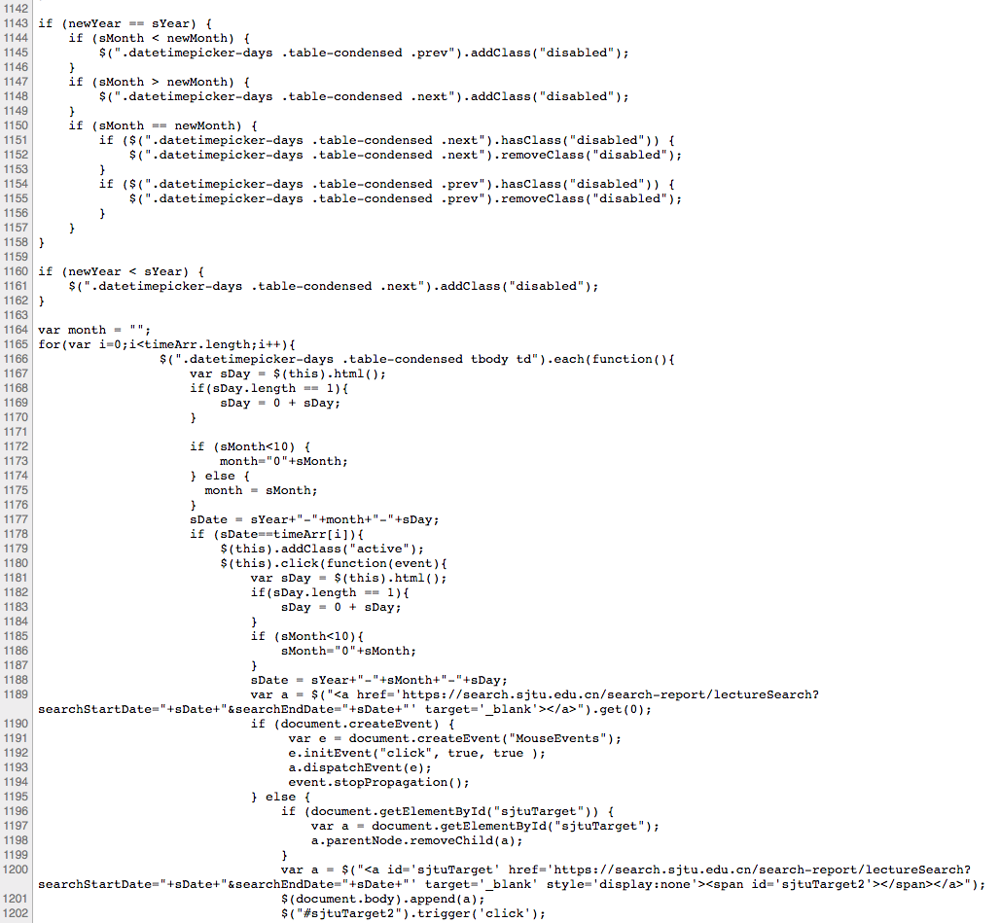
(part of the code)

There is a significant evidence shown above that this coding style of this project is not good.

Obviously it doesn't follow any programming specification except "freestyle". Also, no Static code checking tool like Eslint participating in the development.


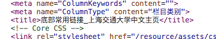

(bad naming "dbcylj")

The names of files and directory are still cofusing. e.g. "dbcylj" is "底部常用连接".

### 3. Comparison

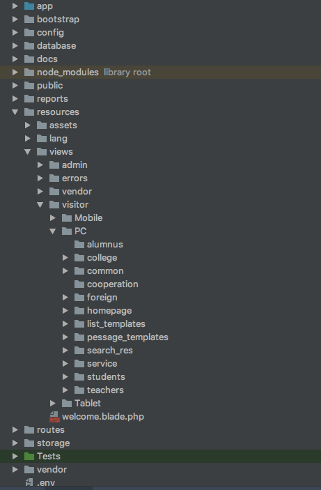

A well-organized project's front-end directory of the writter.

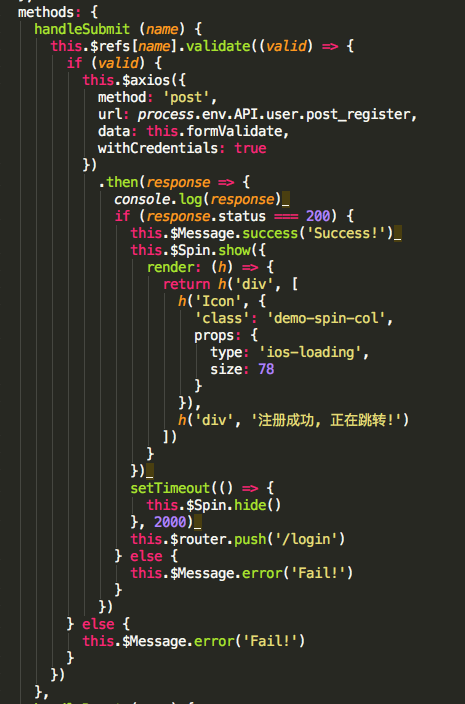

Coding with eslint.

### 4. Optimizations

- Using a good framework and follow it's defination of directories strictly.
- Pick a good programming specification and follow it when developing.
- Add a .eslintrc.js file to the project to constrain the code style.

## III. About the Framework

### 1. MVC + Template rendering

It's for sure that no front-end frameworks are took part in. But it can be infered that the project   used a MVC framework with template rendering funtion. 

The evidence is the "dbcylj" directory. The index.html file here jest contains the bottom bar.

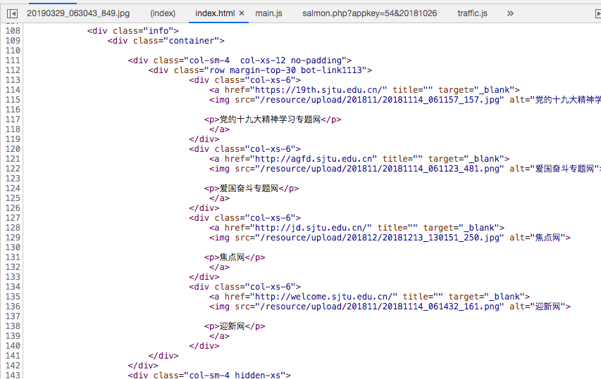
(dbcylj/index.html)


(the bottom bar)

Some php traces are also detected. So the MVC frame may be "laravel".

### 2. Make the best use of it?

About how good the Modal (M) and Controller (C) is used in the project is packaged in the back-end and invisible. But as for the View (V). The project didn't make the beat use. Because except for the poorly wirtten 'dbcylj' part in the bottom. No any other widgets are packaged and shown in the directory. It makes the template renderding almost useless.

### 3. Comparison

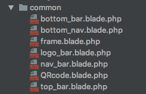

Part of a php MVC project, making each part a single widgets using the template mechanism.

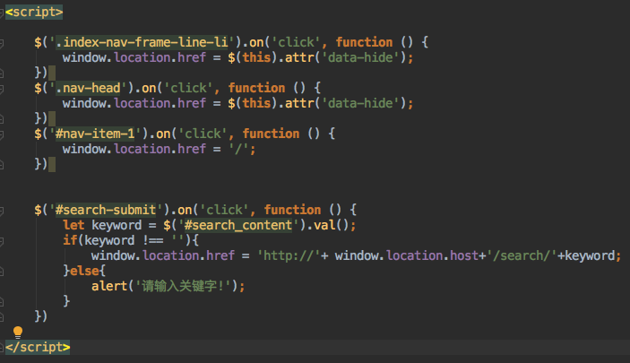

Clean script inside. 

### 4. Optimizations

- Decoupling pages into functionally dependent widgets.
- Pick a modern font-end framework and make a good use of it.

## IV. About the Deployment

### 1. Fully exposed


(a fully exposed directory)

Thanks to its shortcoming in deployment, The whole directory is totally exposed and just lay there to be analysis :). This is due to the absence of **webpack**. No optimization and compression was made when deploying. In other words, It looks more like a dev (developing) branch in the test server than a finished project.

### 2. Performance loss

The absence of webpack caused some resouce and code much larger than the compressed ones. 

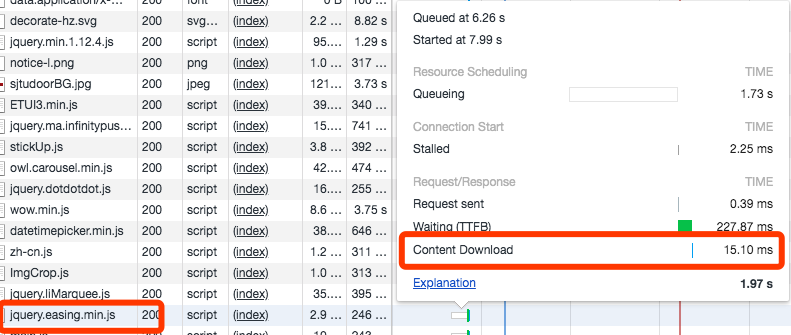

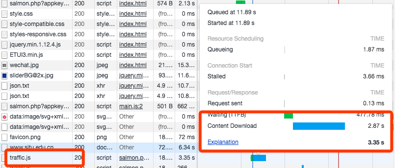

(comparison between compressed one and the not compressed one)

The 'lib' file jQuery is richer but downloaded faster than the self-written traffic.js. This is the performance loss made by bad deployment.

### 3. Comparison

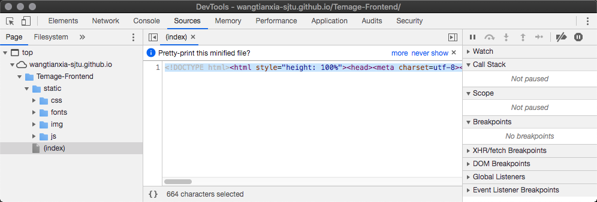

A well-deployed project using webpack. Condense the file in a single line.

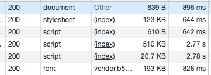

Shrink the file size.

### 4. Optimizations

- Using webpack to deploy.
- Delete developing files.

## V. About Resource Allocation

### 1. Bitmap

Except for dynamic images, Many static decorative images are almost big bitmaps like .jpg or .png. Thoes big files cost much when transporting and look blur when zooming. Even some simple lines and blocks are still stored in the /svg directory as bitmaps.

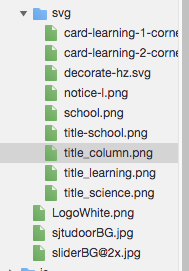

(png and jpg in ./svg) 

The incorrect resource format leads to a waste of network resouces.

### 2. Multi-language and localization

There is a English entance in the top-letf corner.


But when click it, the whole page refresh into a totally diffrent page with diffrent host name.


Many frameworks has integrated localization function that can make the same website fit diffrent languages conviniently. Write two separated website is a wasted of labor and the serve resouce.

### 3. Cost of rendering

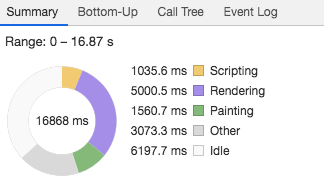

Rendering the page cost the most calculating and memory resource in user-end of this page. 


Considering the visit of this page is not so large. Maybe part of the rendering work can be finished in back-end to optimize.

### 4. Comparison

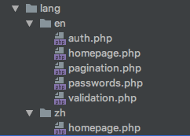

language setting in a php project.

### 5. Optimizations

- Using localization function to provide multi-language website.
- Render in the back-end in low visiting site to optimize performance. 

## VI. Advantages

-  Unified UI concept

-  Adequate information

-  Low memory footprint

  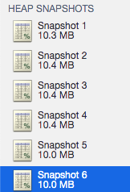

- Secure certificate
  

## VII. Conclusion

The most failed part of this front-end project is the poorly designed structure. It reflects on the chaotic directories and the long and integrated funtions. But after all, it met all the demands of customers and run pretty well facing a normal visitor.

However, as a developer, such kind of project can not be praised to much because of the difficulty to maintain and the waste of resource.

Front-end development does not require a high threshold that almost everyone can pick it up easily. But it doesn't mean that writting a good front-end is a easy task. In fact, any kind of development is not easy. During the development, a good developer will surely **practice thoes methodologies of software engineering** at all levels of development . That is also what distinguishes a good engineer from coding machines.