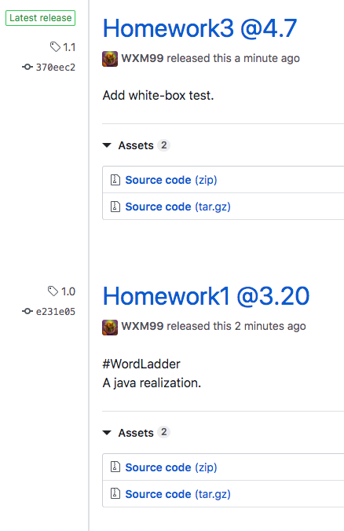

# Word Ladder

> Project1 for course SE418
>
> 516015910018 weixm
>
> visit the project at http://101.132.73.215:8080/ (personal server) 

## Front-end Build Setup

``` bash
cd ./VUE

npm install

npm run dev
```

On localhost:8080

Details on [Vue](./VUE/README.md)

## Back-end Build Setup

```bash
cd ./spring_boot

mvn spring-boot:run
```

On localhost:9090

## Back-end Unit Test

```bash
cd ./spring_boot

./mvnw clean test
```

## Updates

### Homework1 @3.20

#### Back-end Build Setup

```bash
cd ./spring_boot

mvn spring-boot:run
```

On localhost:9090

#### Back-end Unit Test

```bash
cd ./spring_boot

./mvnw clean test
```

### Homework2 @4.7

#### White-box Unit Test with ```java.lang.reflect.Method```

in ./models/wordLadder.java

```java
private ArrayList<String> neighbers(String word)
{
...  
}
```

in ./test/…/WordLadderApplicationTest.java

```java
import java.lang.reflect.Method;
...
@Test
public void neighborsTest() throws Exception {
		Method get_neighbors = wordLadder.class.getDeclaredMethod("neighbers", String.class);
		get_neighbors.setAccessible(true);
		ArrayList<String> neighbors = (ArrayList<String>) get_neighbors.invoke(this.ladder, "code");
		Assert.assertNotEquals("neighbors of \"code\" is not empty", neighbors.size(), 0);
}
```

#### Add 2 Release Versions of Git Workflow

