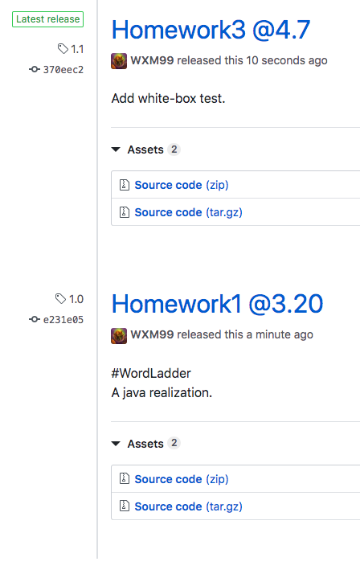

# WordLadder Back-end Project

## Updates

### Homework1 @3.31

#### Back-end Build Setup

```bash
cd ./spring_boot

mvn spring-boot:run
```

On localhost:9090

#### Back-end Unit Test

```bash
cd ./spring_boot

./mvnw clean test
```

### Homework2 @4.7

#### White-box Unit Test with ```java.lang.reflect.Method```

in ./models/wordLadder.java

```java
private ArrayList<String> neighbers(String word)
{
...  
}
```

in ./test/…/WordLadderApplicationTest.java

```java
import java.lang.reflect.Method;
...
@Test
public void neighborsTest() throws Exception {
		Method get_neighbors = wordLadder.class.getDeclaredMethod("neighbers", String.class);
		get_neighbors.setAccessible(true);
		ArrayList<String> neighbors = (ArrayList<String>) get_neighbors.invoke(this.ladder, "code");
		Assert.assertNotEquals("neighbors of \"code\" is not empty", neighbors.size(), 0);
}
```

#### Add 2 Release Versions of Git Workflow



### Homework3 @4.12

#### Gitworkflow — add dev branch

#### MockMVC test

in ```./src/test/.../wordLadderControllerTest.java```

#### Security + Actuator

- Set authorization to /actuator/** apis in security.config

  ```java
  .authorizeRequests()
  /* Public APIs for every user */
  .antMatchers("/login", "/generate", "/validate").permitAll()
  /* Security protected APIs for ADMIN*/
  .antMatchers("/actuator/**").hasRole("ADMIN")
  ```

- Init  an administrator in memory  in security.config

  ```java
  .inMemoryAuthentication()
  .passwordEncoder(new BCryptPasswordEncoder())
  .withUser("admin")
  .password(new BCryptPasswordEncoder().encode("SE418")).roles("ADMIN");
  ```

- Test for Security & Actuator with ```MockMvc``` and ```MockSession``` 

