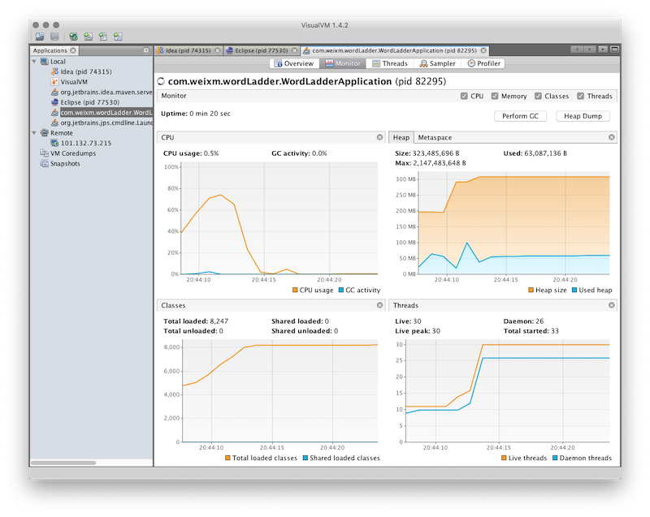
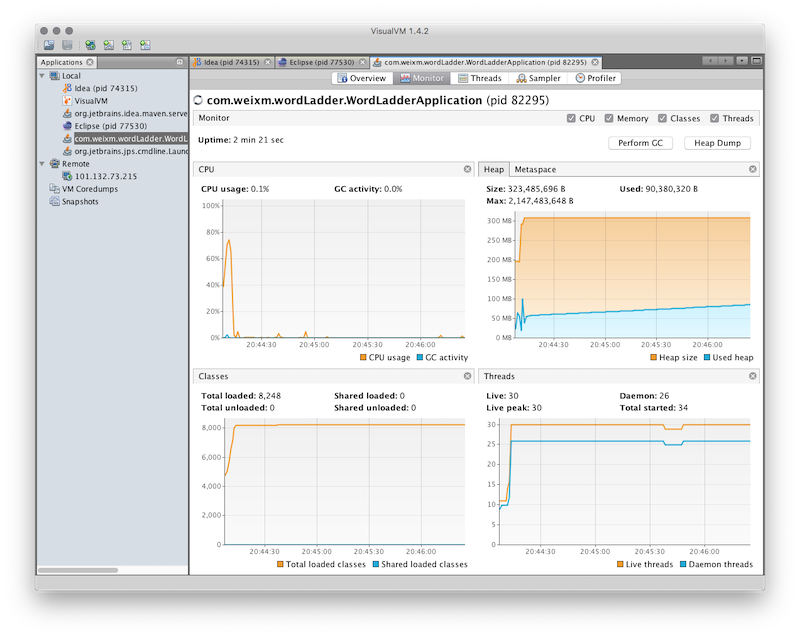
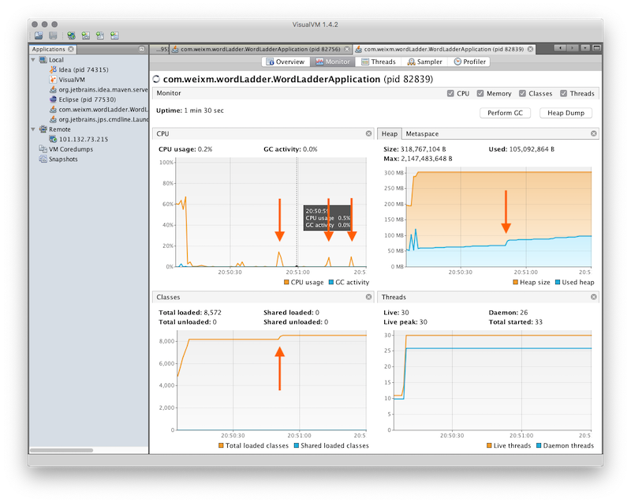
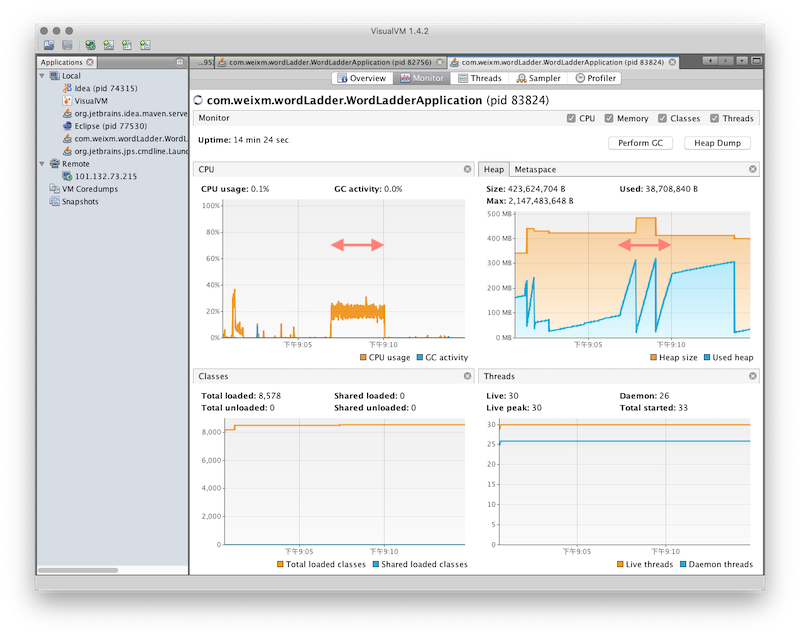
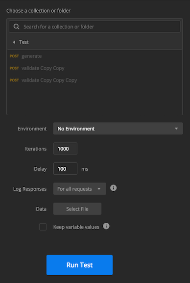
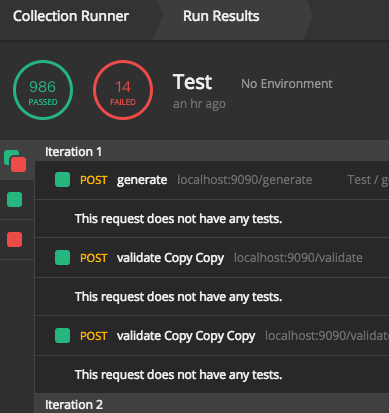
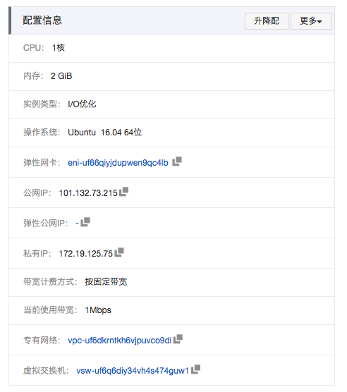
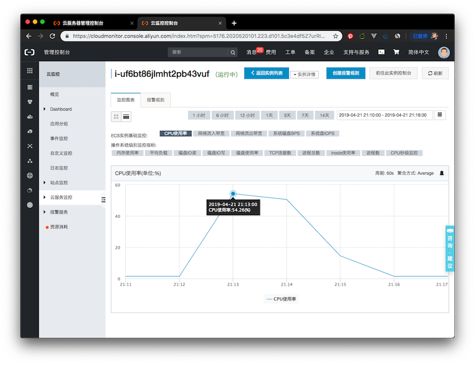
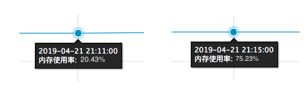

# Resource Consumptions of Rest Service

## Test 1. On localhost:9090

### 0 Env

-   型号名称：	MacBook Pro
-   型号标识符：	MacBookPro12,1
-   处理器名称：	Intel Core i5
-   处理器速度：	2.7 GHz
-   处理器数目：	1
-   核总数：	2
-   L2 缓存（每个核）：	256 KB
-   L3 缓存：	3 MB
-   内存：	8 GB
-   Boot ROM 版本：	MBP121.0177.B00
-   SMC 版本（系统）：	2.28f7
-   序列号（系统）：	C02RXM65FVH3
-   硬件 UUID：	563BC111-DEFC-5BBF-B991-4FA4DA416341

---

### 1 Serve with out service

> State1: 服务启动过程
>
> CPU: 服务初始化时达到峰值,  初始化完成后使用量下降并稳定
>
> Memory: 运行Heap上升后稳定

---

> State 2: 启动后无访问的稳定态
>
> CPU: 稳定并接近于0
>
> Memory: 由于运行时产生log和碎片导致heap均匀缓慢上升

---

### 2 Serve with request

> State 1: 小频率单次访问 (红色箭头处)
>
> CPU: 响应访问时上升到20%左右
>
> Memory: 第一次访问后下幅度跳跃 

---

> State 2: 利用Postman模拟并发访问 (三个接口, 访问1000次, delay = 100ms)
>
> CPU: 访问阶段维持在20%, 访问结束后闲置
>
> Memory: 访问其期间快速上升, 到达300Mb后被迅速释放, 访问结束后很缓慢上升

> 由于heap的强制释放和密集的请求频率, 导致部分请求未响应

## Test 2. On 101.132.73.215:9090

### Env

### 用Postman模拟的并发测试

> 测试脚本与test1相同, 1000次同时发送三个请求, delay=100ms

#### CPU

> 采用阿里云低粒度的性能监控服务 (1min一个采样点)
>
> CPU峰值使用率到达54.26%
>
> 请求完成后下降

#### Memory

> 静息期间平均使用率: 20.43%
>
> 相应服务期间最高使用率: 75.23%
>
> 推断WordLadder服务最高使用率约为55%

